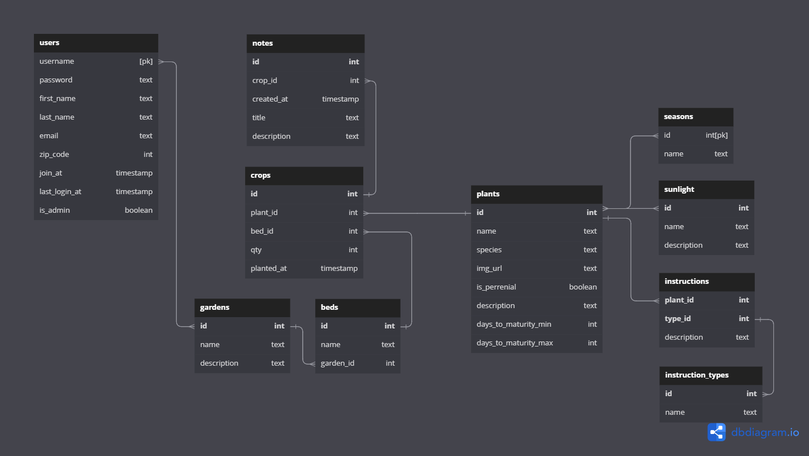

# **GardenGood App**

_Helping gardeners plan, plant, and tend their crops for a thriving garden._


The Garden Good app helps beginner and experienced gardeners plan, plant, and tend their crops for an abudant harvest. This app incorporates weather alerts to help you protect your garden from harsh conditions, and allow it to thrive. From proper feeding and watering to pruning, this app will help you garden GOOD.

I created the simplest form of this application during my time in Springboard's Software Engineering Bootcamp, but it is an ongoing project with more features planned. This first iteration allows users to search for plants and find information on how to take care of the plants in their garden. When a user signs up or logs in, the current weather conditions for their zip code is displayed in the top of the app. The users also have the ability to update their account information.

Live link: https://gardengood.surge.sh/

---

<!-- ## Routes -->

## Database Schema

Database models will consist of the following:

- User
- Garden
- Bed
- Crop
- Plant
- Sunlight
- Season
- Instruction
- Instruction_Type
- Note



---

## Cloning this Repo

```
git clone https://github.com/MattBaltzell/gardengood-backend.git
```

### **Install Backend Dependencies**

Navigate to 'gardengood-backend' directory.

Install all required dependencies with command:

```
npm install
```

### **Create GardenGood Database**

While in the 'gardengood-backend' root directory, run the following command and follow the prompts to create and initialize the database:

```
psql < gardengood.sql
```

### **Start the Backend App**

While in the 'gardengood-backend' root directory, run the command

```
npm run dev <or> npm run start
```

This command will start a backend server under port `3001`.
